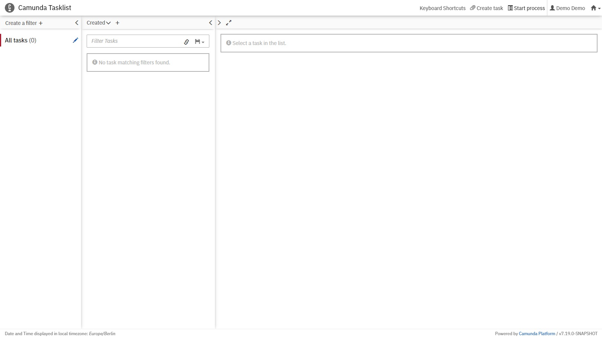

# Anwendungsfall 1: Variationeller Quantenalgorithmus

Dieser Anwendungsfall zeigt die Modellierung und Ausführung eines variationellen Quantenalgorithmus, des [Quantum Approximate Optimization Algorithm (QAOA)](https://arxiv.org/pdf/1411.4028.pdf), zur Lösung des MaxCut Problems mittels QuantMe.

## Setup

Alle Komponenten des Anwendungsfalls können mittels [Docker-Compose](https://docs.docker.com/compose/) gestartet werden, wobei ein entsprechendes Docker-Compose File [hier](./docker/docker-compose.yml) verfügbar ist:

1. Zunächst muss die IP-Adresse der Maschine, auf der die Docker Engine läuft, in das [.env](./docker/.env) eingetragen werden: 
  * ``PUBLIC_HOSTNAME``: Die IP-Adresse muss öffentlich zugänglich sein und es darf *nicht* ``localhost`` verwendet werden.

2. Ausführen des Docker-Compose Files:
```
cd docker
docker-compose pull
docker-compose up
```
3. Nach einigen Minuten sind alle Komponenten verfügbar.

## Modellieren und Ausführen des Anwendungsfalls

Der Quantum Workflow Modeler ist unter folgender URL verfügbar: [http://localhost:8080](http://localhost:8080)

Anschließend wird der folgende Bildschirm angezeigt:


Der Workflow für diesen Anwendungsfall ist [hier](./workflow/vqa_workflow.bpmn) verfügbar und kann mittels ``Open`` oben links im Modeler geöffnet werden:


Vor der Ausführung muss der Workflow in einen nativen Workflow überführt werden, was durch klicken auf den ``Transform Workflow`` erreicht werden kann.
Bei dieser Transformation werden die QuantMe Modellierungskonstrukte durch native Modellierungskonstrukte ersetzt.
Außerdem werden die Data Objects entfernt, da die für die Ausführung verwendete [Camunda BPMN Engine](https://camunda.com/platform-7/workflow-engine/) auf Variablen basiert:


Durch das Klicken auf den ``Deploy Workflow`` Button wird der Workflow in die Camunda BPMN Engine geladen.
Diese kann über [http://localhost:8090](http://localhost:8090) geöffnet werden.
Nach dem Einloggen (Username: demo, Passwort: demo) wird der folgende Bildschirm angezeigt:


In der Camunda Tasklist können Workflowinstanzen gestartet werden:



Dazu wird der Button ``Start process`` oben links verwendet, im Popup der Name des Workflows ausgewählt und schließlich die Eingabedaten übergeben:


Hierbei können alle vorgegebenen Daten beibehalten werden und es muss lediglich das IBMQ Token und das Noise Model, falls ein Simulator gewählt wird, ergänzt werden.
Anschließend wird die Workflow Instanz durch den ``Start`` Button erzeugt.
Die laufenden Workfloswinstanzen können im Camunda Cockpit überwacht worden.
Dieses kann durch klicken auf das Haus-Symbol oben rechts und die Auswahl von ``Cockpit`` geöffnet werden.
Anschließend wird der folgende Bildschirm angezeigt:


Durch das Klicken auf ``Running Process Instances`` und die Auswahl der erzeugten Instanz, können die aktuelle Position des Tokens sowie die aktuellen Variablenwerte angezeigt werden:


Der aktuelle Stand kann durch das Neuladen der Seite aktualisiert werden, bis das Token die letzte Aktivität erreicht, die als User Task umgesetzt ist:


Der User Task kann in der Camunda Tasklist bearbeitet werden.
Dazu wird der entsprechende Auftrag ausgewählt, mittels ``Claim`` aktiviert und über das Öffnen der angegebenen URL das Ergebnis visualisiert:


Dabei wird ein entsprechendes Bild angezeigt, das das Ergebnis des MaxCut Problems darstellt:


Schließlich kann der User Task durch klicken auf ``Complete`` beendet werden und die Workflowinstanz terminiert.

Die gestarteten Komponenten können durch ausführen des folgenden Befehls im Ordner des Docker-Compose Files heruntergefahren werden: ``docker-compose down -v``