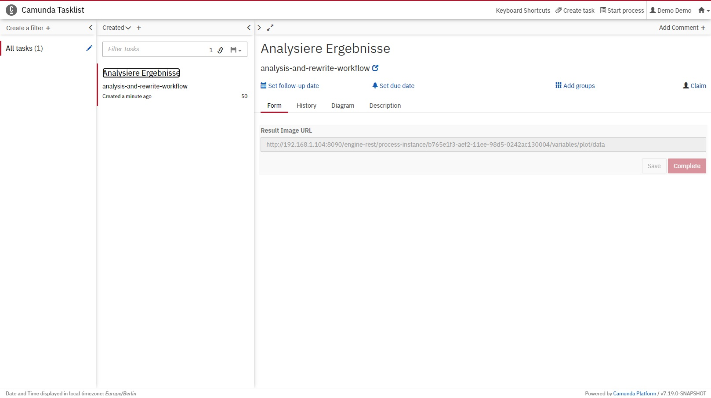

# Anwendungsfall 2: Quantum Humanities

Dieser Anwendungsfall zeigt die Modellierung und Ausführung eines Quanten-Workflows zur Orchestrierung folgender Bearbeitungsschritte im Bereich der Quantum Humanities:

1. Klassische Vorverarbeitung von Kostümdaten

2. Berechnung von Clustern mittels des k-Means Algorithmus auf einem Quantencomputer

3. Trainieren eines Classifiers auf einem Quantencomputer

4. Klassische Evaluation des trainierten Classifiers

## Setup

Alle Komponenten des Anwendungsfalls können mittels [Docker-Compose](https://docs.docker.com/compose/) gestartet werden, wobei ein entsprechendes Docker-Compose File [hier](./docker/docker-compose.yml) verfügbar ist:

1. Zunächst muss die IP-Adresse der Maschine, auf der die Docker Engine läuft, in das [.env](./docker/.env) eingetragen werden:
  * ``PUBLIC_HOSTNAME``: Die IP-Adresse muss öffentlich zugänglich sein und es darf *nicht* ``localhost`` verwendet werden.

2. Ausführen des Docker-Compose Files:
```
cd docker
docker-compose pull
docker-compose up
```
3. Nach einigen Minuten sind alle Komponenten verfügbar.

## Modellieren und Ausführen des Anwendungsfalls

Der Quantum Workflow Modeler ist unter folgender URL verfügbar: [http://localhost:8080](http://localhost:8080)

Anschließend wird der folgende Bildschirm angezeigt:


Der Workflow für diesen Anwendungsfall ist [hier](./workflow/quantum-humanities-workflow.bpmn) verfügbar und kann mittels ``Open`` oben links im Modeler geöffnet werden:


Vor der Ausführung muss der Workflow in einen nativen Workflow überführt werden, was durch klicken auf ``Transform Workflow`` erreicht werden kann.
Bei dieser Transformation werden die QuantMe Modellierungskonstrukte durch native Modellierungskonstrukte ersetzt.
Diese Transformation muss für den Anwendungsfall zwei mal durchgeführt werden, da zunächst bei der Ersetzung der Quantum Computation Tasks neue Quantum Circuit Execution Tasks eingefügt werden, die dann in der zweiten Transformation durch native Modellierungskonstrukte ersetzt werden:


Um den Workflow auszuführen, können die erforderlichen Services mittels der an die Aktivitäten angehängten Deploymentmodelle bereitgestellt werden.
Der Dialog für die Bereitstellung wird durch klicken auf ``OpenTOSCA`` und anschließend ``Service Deployment`` geöffnet.
Dieser bietet eine Übersicht über alle CSARs die für die Bereitstellung in den OpenTOSCA Container geladen werden müssen.
Der Upload wird über den ``Upload CSARs`` Button gestartet:


Nach erfolgreichem Upload der CSARs fragt der Dialog die erforderlichen Eingabedaten für die Bereitstellung der Services vom Nutzer ab.
Dies umfasst beispielsweise das Projekt bzw. die Gruppe der Quantencomputer die bei IBMQ verwendet werden sollen.

Im Beispiel werden die folgenden Daten verwendet:

  * ``ibmqGroup``: open
  * ``ibmqHub``: ibm-q
  * ``ibmqProject``: main
  * ``ibmqUrl``: https://auth.quantum-computing.ibm.com/api


Anschließend werden die erforderlichen Services vom OpenTOSCA Container bereitgestellt, was mehrere Minuten in Anspruch nehmen kann.
Nach der Bereitstellung muss das Binding der Services mit dem Workflow durchgeführt werden.
Hierfür listet der Dialog alle Service Tasks auf, die automatisch durch klicken auf ``Perform Binding`` für den Aufruf der Services angepasst werden:


Durch klicken auf den ``Deploy Workflow`` Button wird der Workflow in die Camunda BPMN Engine geladen.
Diese kann über [http://localhost:8090](http://localhost:8090) geöffnet werden.
Nach dem Einloggen (Username: demo, Passwort: demo) wird der folgende Bildschirm angezeigt:


In der Camunda Tasklist können Workflowinstanzen gestartet werden:


Dazu wird der Button ``Start process`` oben links verwendet, im Popup der Name des Workflows ausgewählt und schließlich die Eingabedaten übergeben:


Hierbei muss ein Token für den Zugriff auf IBMQ angegeben und eine zu verwendende QPU ausgewählt werden (im Beispiel der ibmq_qasm_simulator).
Zudem wird die URL für den Zugriff auf die erforderlichen Kostümdaten angegeben, wobei [hier](./data) zwei Beispieldatensätze verfügbar sind.
Anschließend wird die Workflow Instanz durch den ``Start`` Button erzeugt.
Die laufenden Workfloswinstanzen können im Camunda Cockpit überwacht worden.
Dieses kann durch klicken auf das Haus-Symbol oben rechts und die Auswahl von ``Cockpit`` geöffnet werden.
Dabei wird der folgende Bildschirm angezeigt:


Durch das Klicken auf ``Running Process Instances`` und die Auswahl der erzeugten Instanz, können die aktuelle Position des Tokens sowie die aktuellen Variablenwerte angezeigt werden:


Der aktuelle Stand kann durch das Neuladen der Seite aktualisiert werden, bis das Token die letzte Aktivität erreicht, die als User Task umgesetzt ist:


Der User Task kann in der Camunda Tasklist bearbeitet werden.
Dazu wird der entsprechende Auftrag ausgewählt, mittels ``Claim`` aktiviert und über das Öffnen der angegebenen URL das Ergebnis visualisiert:



Dabei wird ein entsprechendes Bild angezeigt, das die Evaluation des trainierten Classifiers darstellt:


Schließlich kann der User Task durch klicken auf ``Complete`` beendet werden und die Workflowinstanz terminiert.

Die gestarteten Komponenten können durch ausführen des folgenden Befehls im Ordner des Docker-Compose Files heruntergefahren werden: ``docker-compose down -v``