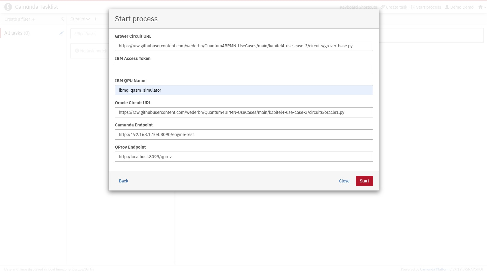
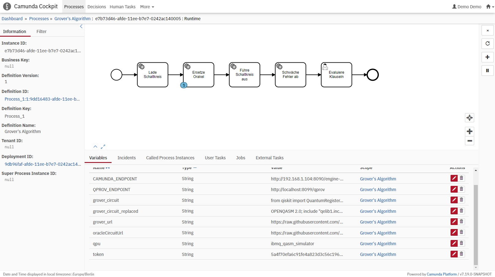
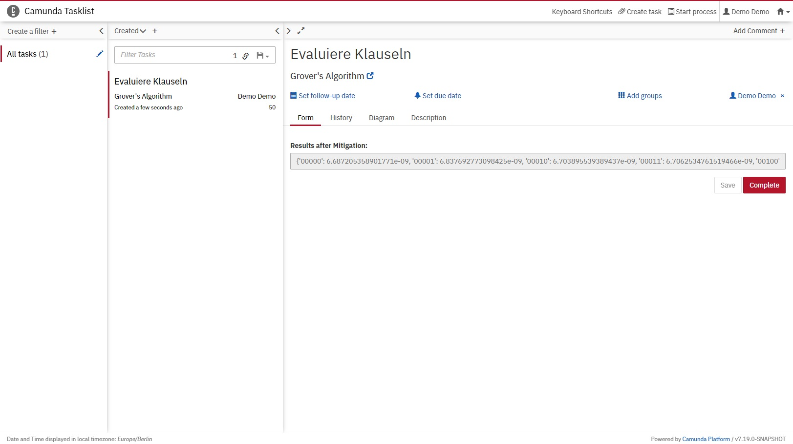

# Anwendungsfall 3: Grovers Algorithmus

Dieser Anwendungsfall zeigt die Modellierung und Ausführung von [Grovers Algorithmus](https://dl.acm.org/doi/pdf/10.1145/237814.237866) mittels eines Quanten-Workflows.

## Setup

Alle Komponenten des Anwendungsfalls können mittels [Docker-Compose](https://docs.docker.com/compose/) gestartet werden, wobei ein entsprechendes Docker-Compose File [hier](./docker/docker-compose.yml) verfügbar ist:

1. Zunächst muss die IP-Adresse der Maschine, auf der die Docker Engine läuft, in das [.env](./docker/.env) eingetragen werden: 
  * ``PUBLIC_HOSTNAME``: Die IP-Adresse muss öffentlich zugänglich sein und es darf *nicht* ``localhost`` verwendet werden.

2. Ausführen des Docker-Compose Files:
```
cd docker
docker-compose pull
docker-compose up
```
3. Nach einigen Minuten sind alle Komponenten verfügbar.

## Modellieren und Ausführen des Anwendungsfalls

Der Quantum Workflow Modeler ist unter folgender URL verfügbar: [http://localhost:8080](http://localhost:8080)

Anschließend wird der folgende Bildschirm angezeigt:


Der Workflow für diesen Anwendungsfall ist [hier](./workflow/grover_workflow.bpmn) verfügbar und kann mittels ``Open`` oben links im Modeler geöffnet werden:


Vor der Ausführung muss der Workflow in einen nativen Workflow überführt werden, was durch klicken auf den ``Transform Workflow`` erreicht werden kann.
Bei dieser Transformation werden die QuantMe Modellierungskonstrukte durch native Modellierungskonstrukte ersetzt:


Durch das Klicken auf den ``Deploy Workflow`` Button wird der Workflow in die Camunda BPMN Engine geladen.
Diese kann über [http://localhost:8090](http://localhost:8090) geöffnet werden.
Nach dem Einloggen (Username: demo, Passwort: demo) wird der folgende Bildschirm angezeigt:


In der Camunda Tasklist können Workflowinstanzen gestartet werden:


Dazu wird der Button ``Start process`` oben links verwendet, im Popup der Name des Workflows ausgewählt und schließlich die Eingabedaten übergeben:



Hierbei können alle vorgegebenen Daten beibehalten werden und es muss lediglich das IBMQ Token und der zu verwendende Quantencomputer bzw. Simulator ergänzt werden.
Anschließend wird die Workflow Instanz durch den ``Start`` Button erzeugt.
Die laufenden Workfloswinstanzen können im Camunda Cockpit überwacht worden.
Dieses kann durch klicken auf das Haus-Symbol oben rechts und die Auswahl von ``Cockpit`` geöffnet werden.
Anschließend wird der folgende Bildschirm angezeigt:


Durch das Klicken auf ``Running Process Instances`` und die Auswahl der erzeugten Instanz, können die aktuelle Position des Tokens sowie die aktuellen Variablenwerte angezeigt werden:



Der aktuelle Stand kann durch das Neuladen der Seite aktualisiert werden, bis das Token die letzte Aktivität erreicht, die als User Task umgesetzt ist:


Der User Task kann in der Camunda Tasklist bearbeitet werden.
Dazu wird der entsprechende Auftrag ausgewählt, mittels ``Claim`` aktiviert und das Ergebnis mit den meisten Shots kann als finales Ergebnis des Algorithmus extrahiert werden:



Schließlich kann der User Task durch klicken auf ``Complete`` beendet werden und die Workflowinstanz terminiert.

Die gestarteten Komponenten können durch ausführen des folgenden Befehls im Ordner des Docker-Compose Files heruntergefahren werden: ``docker-compose down -v``